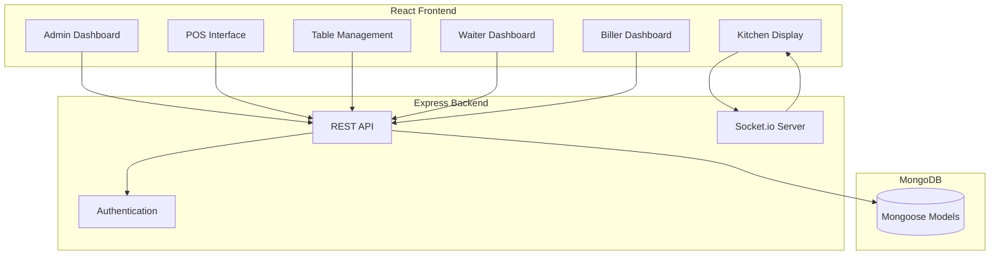

# Restaurant POS System - Technical Specification

## 1. Project Overview

A comprehensive Point of Sale system for restaurants featuring table management, real-time kitchen order tickets (KOT), role-based dashboards for waiters/billers, and a full admin control panel.

## 2. Technology Stack

- **Frontend**: React 18 + Material-UI (MUI) v5
- **Backend**: Node.js + Express.js
- **Database**: MongoDB with Mongoose ODM
- **Real-time**: Socket.io for KOT updates
- **Authentication**: JWT with bcrypt
- **Build Tools**: Vite (frontend), concurrently (dev orchestration)

## 3. Architecture



## 4. Database Schema

### User Collection
```
{
  _id: ObjectId,
  username: String (unique),
  password: String (hashed),
  role: Enum['admin', 'waiter', 'biller'],
  name: String,
  isActive: Boolean,
  createdAt: Date,
  updatedAt: Date
}
```

### Category Collection
```
{
  _id: ObjectId,
  name: String,
  description: String,
  displayOrder: Number,
  isActive: Boolean,
  createdAt: Date
}
```

### MenuItem Collection
```
{
  _id: ObjectId,
  name: String,
  description: String,
  price: Number,
  category: ObjectId (ref: Category),
  isAvailable: Boolean,
  prepTime: Number (minutes),
  createdAt: Date
}
```

### Table Collection
```
{
  _id: ObjectId,
  tableNumber: String,
  capacity: Number,
  status: Enum['available', 'occupied', 'reserved'],
  currentOrder: ObjectId (ref: Order),
  position: { x: Number, y: Number },
  createdAt: Date
}
```

### Order Collection
```
{
  _id: ObjectId,
  orderNumber: String,
  table: ObjectId (ref: Table),
  waiter: ObjectId (ref: User),
  customerName: String,
  customerPhone: String,
  items: [{
    menuItem: ObjectId (ref: MenuItem),
    quantity: Number,
    price: Number,
    status: Enum['pending', 'preparing', 'ready', 'served'],
    notes: String
  }],
  subtotal: Number,
  tax: Number,
  discount: Number,
  total: Number,
  paymentStatus: Enum['pending', 'paid', 'partial'],
  paymentMethod: Enum['cash', 'card', 'upi'],
  status: Enum['active', 'completed', 'cancelled'],
  createdAt: Date,
  completedAt: Date
}
```

### KOT (Kitchen Order Ticket) Collection
```
{
  _id: ObjectId,
  order: ObjectId (ref: Order),
  items: [{
    menuItem: ObjectId,
    name: String,
    quantity: Number,
    notes: String,
    status: Enum['pending', 'preparing', 'ready']
  }],
  status: Enum['new', 'in-progress', 'completed'],
  priority: Number,
  createdAt: Date,
  completedAt: Date
}
```

## 5. API Endpoints

### Authentication
- `POST /api/auth/login` - User login
- `POST /api/auth/logout` - User logout
- `GET /api/auth/me` - Get current user

### Menu Management
- `GET /api/categories` - List all categories
- `POST /api/categories` - Create category (admin)
- `PUT /api/categories/:id` - Update category (admin)
- `DELETE /api/categories/:id` - Delete category (admin)
- `GET /api/menu` - List all menu items
- `POST /api/menu` - Create menu item (admin)
- `PUT /api/menu/:id` - Update menu item (admin)
- `DELETE /api/menu/:id` - Delete menu item (admin)

### Table Management
- `GET /api/tables` - List all tables
- `POST /api/tables` - Create table (admin)
- `PUT /api/tables/:id` - Update table (admin)
- `PUT /api/tables/:id/status` - Update table status

### Orders
- `GET /api/orders` - List orders (filterable by status/date)
- `POST /api/orders` - Create new order
- `PUT /api/orders/:id` - Update order
- `PUT /api/orders/:id/status` - Update order status
- `PUT /api/orders/:id/payment` - Process payment

### KOT
- `GET /api/kot` - Get active KOTs
- `POST /api/kot` - Create KOT from order
- `PUT /api/kot/:id` - Update KOT status

### Users (Admin)
- `GET /api/users` - List users
- `POST /api/users` - Create user
- `PUT /api/users/:id` - Update user
- `DELETE /api/users/:id` - Deactivate user

## 6. Frontend Routes

| Route | Component | Access |
|-------|-----------|--------|
| `/login` | LoginPage | Public |
| `/` | Redirect to role-based dashboard | Auth |
| `/pos` | POS Interface | Admin, Biller |
| `/tables` | Table Management | All |
| `/kot` | Kitchen Display | Kitchen |
| `/waiter` | Waiter Dashboard | Waiter |
| `/biller` | Biller Dashboard | Biller |
| `/admin` | Admin Dashboard | Admin |
| `/admin/menu` | Menu Management | Admin |
| `/admin/users` | User Management | Admin |
| `/admin/settings` | System Settings | Admin |

## 7. Key Features Implementation

### Real-time KOT (Socket.io)
```javascript
// Events
- 'kot:new' - New order sent to kitchen
- 'kot:update' - KOT status changed
- 'kot:ready' - Item ready for serving
- 'table:update' - Table status changed
```

### Role-Based Access Control
```javascript
const permissions = {
  admin: ['*'],
  waiter: ['tables', 'orders:create', 'orders:read', 'kot:read'],
  biller: ['orders', 'tables', 'payments'],
  kitchen: ['kot']
}
```

## 8. Project Structure

```
vela-pos/
├── server/
│   ├── config/
│   │   └── db.js
│   ├── models/
│   │   ├── User.js
│   │   ├── Category.js
│   │   ├── MenuItem.js
│   │   ├── Table.js
│   │   ├── Order.js
│   │   └── KOT.js
│   ├── routes/
│   │   ├── auth.js
│   │   ├── categories.js
│   │   ├── menu.js
│   │   ├── tables.js
│   │   ├── orders.js
│   │   ├── kot.js
│   │   └── users.js
│   ├── middleware/
│   │   ├── auth.js
│   │   └── rbac.js
│   ├── socket/
│   │   └── index.js
│   ├── seeders/
│   │   ├── demo.js
│   │   └── production.js
│   ├── server.js
│   └── package.json
├── client/
│   ├── src/
│   │   ├── components/
│   │   ├── pages/
│   │   ├── context/
│   │   ├── hooks/
│   │   ├── services/
│   │   ├── theme/
│   │   ├── App.jsx
│   │   └── main.jsx
│   ├── index.html
│   ├── package.json
│   └── vite.config.js
├── scripts/
│   ├── start-server.bat
│   ├── create-shortcut.vbs
│   └── get-ip.bat
├── .env.example
└── README.md
```

## 9. Windows Helper Scripts

### start-server.bat
- Detects local IP address
- Starts MongoDB (if local)
- Launches backend server
- Shows connection info

### create-shortcut.vbs
- Creates desktop shortcut
- Sets working directory
- Configures icon

## 10. Demo Data Seeding

Seeds include:
- 3 users (admin, waiter, biller)
- 5 categories (Appetizers, Main Course, Beverages, Desserts, Snacks)
- 20+ menu items with prices
- 10 tables with different capacities

## 11. Environment Variables

```
# Server
PORT=5000
NODE_ENV=development

# Database
MONGODB_URI=mongodb://localhost:27017/vela-pos

# JWT
JWT_SECRET=your-secret-key-change-in-production

# Client (for CORS)
CLIENT_URL=http://localhost:5173
```
